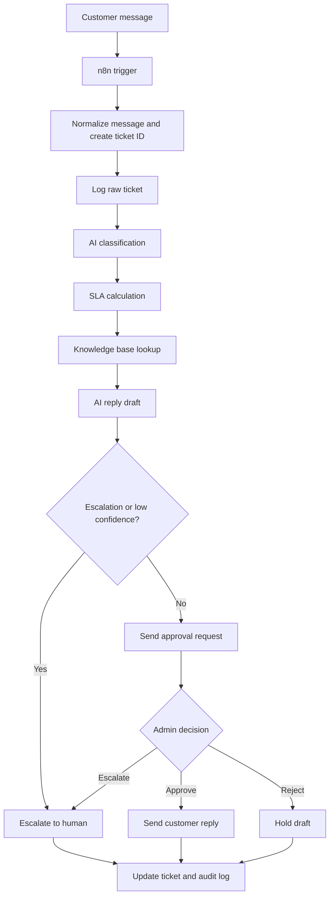

# Workflow Architecture

## System Boundaries

The AI does not issue refunds, change account settings, make legal promises, or guarantee timelines. It drafts replies and routing recommendations only.

## Reliability Features

- Raw ticket logged before AI processing
- Structured classification output
- Confidence thresholds
- Escalation rules
- Human approval before external replies
- SLA monitoring
- Audit log for major events

## What To Show In A Portfolio

- Screenshot of the n8n workflow canvas
- Screenshot of the support ticket database
- Screenshot of the knowledge base
- Screenshot of the admin approval message
- Screenshot of the AI-generated draft reply
- Short demo video showing a customer message being triaged

